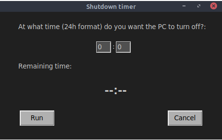

# Shutdown_timer
This is a program written in python to program the shutdown time of your pc and you can see how much time is left for it to occur.

You have to enter the exact time you want it to turn off, in 24 hour format and press the run button. 
If you want to cancel the scheduled shutdown time, you must press the cancel button.

Any contribution you want to make is welcome.
 
